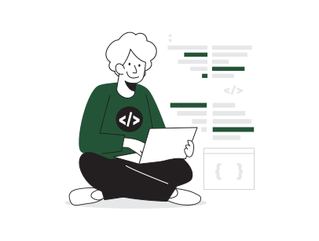

<h1 align="center"><b>Hi , I'm JuanDi Here</b></h1>

 

## 😼 About me

<picture> </picture>

 

- A passionate Full-Stack developer
- A real lover of web development
- Student of various branches of programming
- VideoGames player

  

## <b> Skills</b>

 

- **Languages**:

  
  
  

    
    
- **Front-End Development**:

  
  
  
  
  

 

    
- **Back-End Development**:

  
  
  

 

- **Databases**:

  
  
  
  
  

  

 

- **Softwares and Tools**:

  
  
  
  

 
 
 

---

## <b> Github Stats </b>

 

 
 
 

---

 
 

## <b> Let's Connect..!</b>

 

<ul>

<li>

</li>

 

<li>

</li>

 

<li>

</li>
	
</ul>

